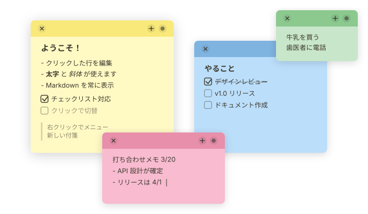

<div align="center">
  
  <h1>🐻 貼っとっと (Hattotto)</h1>
  <p>デスクトップにぺたぺた貼れる、熊の手つき付箋アプリ<br>軽量・ネイティブ・macOS Stickies ライクな操作感</p>
</div>

<p align="center">
  <a href="README.md">English</a>
</p>

<p align="center">
  
</p>

## こだわりポイント

macOS Stickies との主な違い

- Markdown が書ける
- 一つの付箋をクリックしたら全付箋が前面に出てくる
  - Alfred などのランチャーや Mission Control から開くときに便利！
- 削除した付箋をゴミ箱から戻せる
- よく使うボタンが付箋の上に表示できる

## 機能

- 📋 Markdown 対応
  - 👀 編集中もカーソルのある行だけが生 Markdown になり、他の行は描画されたまま
  - ✏️ 入力補助付き（箇条書き・番号リスト等の Enter 自動継続）
  - 🔗 リッチテキストのペーストは Markdown に自動変換
- 🪟 一つの付箋をクリックしたら全付箋が前面に出てくる
- 🎨 6 色のカラーテーマ
- 🗑️ ゴミ箱機能（削除した付箋を復元可能・最大 200 件保持）
- 🔍 付箋ごとのズーム設定（⌘+ / ⌘- / ⌘0）
- 🌐 日本語・英語の表示切替（OS のロケールに従うか、設定画面で固定）
- ⚙️ 設定画面（デフォルトカラー / 透過度 / 表示ボタン制御 / 削除確認 / 自動起動）

## インストール

### Homebrew (推奨)

```bash
brew trust somei-san/tap
brew install --cask somei-san/tap/hattotto
```

`brew trust` は初回のみ必要です。Homebrew 6 以降、信頼していない tap の cask は読み込まれません。これを省くと `brew upgrade` が hattotto をエラーも出さず飛ばすため、更新されないことに気づきにくくなります。

> **Note:** コード署名がないため、インストール時に quarantine 属性を自動解除します。

## データ保存先

```
~/Library/Application Support/com.hattotto.app/
├── notes.json      # 付箋データ
├── settings.json   # 設定
└── trash.json      # ゴミ箱（最大 200 件）
```

## リンク

- [開発ガイド](DEVELOPMENT.md)
- [Homebrew Tap リポジトリ](https://github.com/somei-san/homebrew-tap)

## 支援

[](https://buymeacoffee.com/somei)

## 名前の由来

「貼っとっと」とは熊本弁で「貼ってるよ」という意味です
