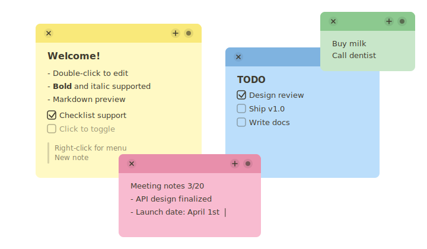

# 🐻 貼っとーと (Hatto-to)
デスクトップにぺたぺた貼れる、熊の手つき付箋アプリ

軽量・ネイティブ・macOS Stickies ライクな操作感

<p align="center">
  
</p>

## こだわりポイント
macOS Stickiesとの重要な違い

- markdown対応
- 一つの付箋をクリックしたら全付箋が前面に出てくる
  - ランチャー（Alfredなど）で開く、Mission Controlで開くなどした際に便利
- ゴミ箱からの復元ができる
- シュッと使いたい機能へのアクセスが良い
- 多少はマシな見た目

## 機能

- 📝 付箋ごとに独立ウィンドウ（フレームレス）
- 🎨 6色カラーテーマ（黄・青・緑・ピンク・紫・グレー）
- 💾 自動保存（テキスト・位置・サイズ・ズーム）
- 🔄 起動時に前回の付箋を復元
- ➕ 新規付箋の追加（ボタン / トレイメニュー / ⌘N）
- 🗑️ ゴミ箱機能（削除した付箋を復元可能・最大20件保持）
- 🔍 付箋ごとのズーム設定（⌘+ / ⌘- / ⌘0）
- 📋 Markdownプレビュー（見出し・箇条書き・チェックボックス・太字・斜体・取消線・コード・引用・番号リスト・区切り線・リンク）
- ✏️ Markdown入力補助（箇条書き・番号リスト等のEnter自動継続）
- 🔗 リッチテキストペースト → Markdown自動変換
- 🖱️ カスタム右クリックメニュー
- ⚙️ 設定画面（デフォルトカラー / 文字サイズ / 表示倍率 / 透過度 / 編集切替方式 / 自動起動）

## インストール

### Homebrew (推奨)

```bash
brew install --cask somei-san/tap/hatto-to
```

## データ保存先

```
~/Library/Application Support/com.hatto-to.app/
├── notes.json      # 付箋データ
├── settings.json   # 設定
└── trash.json      # ゴミ箱（最大20件）
```

### 開発者向け

[開発ガイド](DEVELOPMENT.md) を参照。